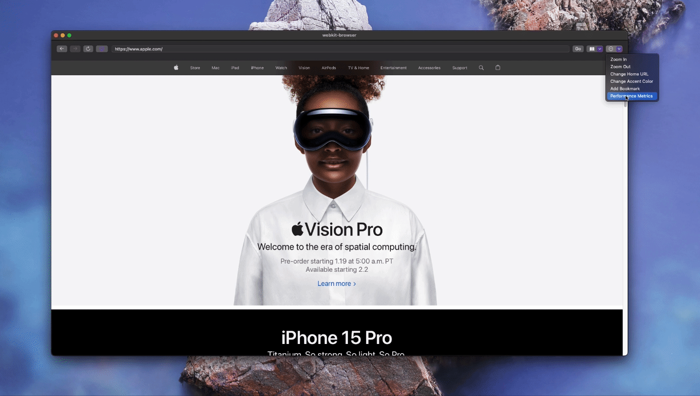

# WebKit Browser 

Simple web browser for macOS and iOS powered by webkit. Includes basic browser functionality and monitors performance metrics.

Video Demo: [Link](https://observablehq.com/d/ccd757b5ff0c4d8f)

# Features
- Search (Links and Google Search)
- Buttons (Back/Forward/Reload/Home)
- Customizable Bookmarks
- Performance Metrics Page
- MacOS and iOS Support
- Scaling
- Color Accent Randomizer
- Light/Dark Mode

# Requirements for Developement: 
To ensure MacOS support while developing this app in XCode, make sure to turn App Sandbox ON in your target and tick Networks Outgoing Connections. 

See [development](development.md) for future development plans.
